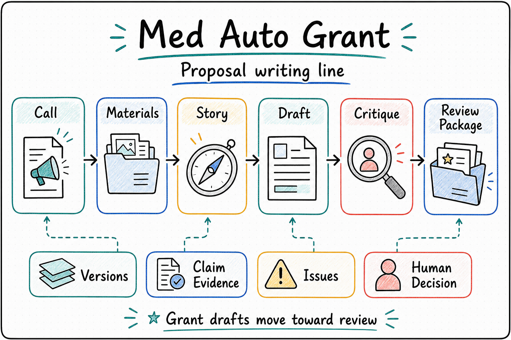

  

  <a href="./README.md"><strong>English</strong></a> | <a href="./README.zh-CN.md">中文</a>

<!--
Owner: Med Auto Grant
Purpose: public repository entry
State: current_public
Machine boundary: Human-readable entry only. Machine truth remains in current-program, root contracts, schemas, source, CLI/API behavior, runtime receipts, and grant workspace artifacts.
-->

# Med Auto Grant

**An AI grant-writing workspace for medical teams, keeping topic framing, body drafting, critique, revision, and review-package delivery on one traceable application line.**

A medical grant proposal is more than a form to fill in. A review-ready application needs the target call, research foundation, scientific question, technical route, applicant fit, and reviewer concerns to stay aligned across many rounds of work.

Once AI moves from "polish this paragraph" to "help me finish this proposal," several problems show up quickly:

- The funding call is fixed, but how should prior papers, pilot evidence, and applicant strengths become one clear scientific story?
- After many revisions, which version solved which problem, and which hard issues remain open?
- Can the system review the draft like a grant reviewer and turn critique into the next revision?
- Can portal forms and objective supplements stay separate from the scientific body instead of blocking the writing loop?
- Can longer writing and revision work continue while the user is away, with progress and blockers left behind for review?

`Med Auto Grant` is built around those questions. For a specified funding task, it keeps material organization, proposal drafting, reviewer-style critique, revision rounds, and review-package delivery inside one workspace so a draft can move toward a version worth showing to experts.

It does not treat grant writing as fixed-template filling. A proposal can keep comparing narrative options, checking claims against evidence, absorbing reviewer-style critique, and producing the next stronger body and review package under the same funding call.

<table>
  <tr>
    <td width="33%" valign="top">
      <strong>Who It Serves</strong> 
      Doctors, PIs, faculty members, and medical research teams preparing researcher-led medical grant applications
    </td>
    <td width="33%" valign="top">
      <strong>What It Organizes</strong> 
      A specified funding call, prior work, pilot evidence, draft versions, review comments, and review-package files inside one workspace
    </td>
    <td width="33%" valign="top">
      <strong>How To Start</strong> 
      Tell it the target funding call, your current draft/materials, scientific claims to defend, and the review package you need
    </td>
  </tr>
</table>

  

## Core Highlights

**Continuous Writing Around One Funding Call** 
It does not give generic advice. It keeps working under the same target call, organizing materials, rewriting the body, closing issues, and advancing versions.

**From Materials To A Review Package** 
Papers, pilot evidence, applicant background, and constraints are shaped into title, abstract, aims, research plan, technical route, and applicant narrative, then collected into a review-ready proposal package.

**Reviewer-Style Critique That Turns Into Revision** 
Each round can examine scientific question, significance, novelty, technical route, applicant fit, and evidence gaps, then turn the critique into the next draft.

**Traceable Progress And Versions** 
The workspace keeps drafts, comments, version changes, quality scorecards, and evidence-gap reports together so the team can see where the proposal stands.

**Scientific Writing And Portal Supplements Stay Separate** 
Portal submission, formal forms, and objective supplements are tracked as their own follow-up work. The default focus is to make the scientific body reviewable first.

**Room For Judgment And Revision** 
The system does not mechanically revise in a fixed order. It can generate options, compare versions, locate hard weaknesses, rewrite weak sections, and keep the change history plus quality movement in one workspace.

## One-Sentence Quick Start

You can start with prompts like:

- "Use this NSFC call and this draft to rebuild title, abstract, aims, and methods so the scientific story is internally consistent."
- "Review this current draft for claim-evidence gaps and rewrite the weak sections without changing the target funding call."
- "Review this draft like a grant reviewer, tell me the biggest weaknesses, and show me how to revise them."

## What It Helps With

- Turning prior work, pilot data, and applicant materials into a stronger title, abstract, aims, and research plan under a specified funding call.
- Keeping revision rounds, reviewer-style critique, and version changes traceable inside one workspace.
- Comparing proposal quality across versions through structured scorecards, issue closure, and evidence-gap reports.
- Running longer writing and revision cycles that can continue, roll back, or stop with a blocker report.
- Delivering a scientifically complete review-ready package before portal-facing formal checks.
- Tracking formal/objective supplements as explicit follow-up work, instead of blocking body authoring by default.
- Comparing narrative options, evidence support, and reviewer-style critique inside the same funding task, then producing the next more-reviewable body draft.

## How It Works

- Applicants provide the target funding call, existing evidence, constraints, and final judgment.
- The AI operator helps with scientific structure, option comparison, drafting, critique, and revision within that call.
- The workspace keeps comments, versions, and deliverable files together so the proposal line stays reviewable.
- New intake workspaces are directory scaffolds: `workspace.json` is the canonical document, while lightweight contracts/artifacts can be Git-tracked and local runtime outputs remain ignored.

## Current Boundary

- `Med Auto Grant` is an independent medical grant domain agent, not an internal module inside the `OPL` workspace.
- In the OPL family, MAG is the grant-writing domain agent package: MAG keeps grant authority, while OPL owns generic runtime, package carrier, generated wrapper, and hosted surfaces.
- Its first public surface is the single Med Auto Grant app skill; `Codex`, `OPL`, and other general agents can reach stable capabilities through that skill.
- MAG owns the grant-writing work itself: funding-call understanding, proposal structure, scientific questions, evidence organization, drafting, revision, and review-ready delivery packages. One Person Lab handles hosted runtime, progress display, recovery/retry, and the cross-agent product entry.
- It can be used as the Grant Foundry inside One Person Lab, and it can also be called directly by Codex or another agent through stable capability entries.
- MAG task scope is locked to body authoring for a specified funding call.
- Scientific completion is delivered as a review-ready package; formal/objective supplements are tracked separately.
- Formal/objective supplements default to `TODO + explicit wakeup` and do not block body authoring unless they directly break scientific validity.
- Human gate decisions stay inside the same funding-call task and are author decisions, not cross-funder reselection.
- External funding portal submission stays under human supervision.

  
<strong>Technical OPL / executor boundary</strong>

- `OPL` can host MAG as an external domain agent and provide stage scheduling, wakeups, handoffs, receipts, retries, and projections.
- MAG keeps the grant-facing authority: grant truth, fundability and writing-quality judgment, route evidence and constraints, and submission/export authority. A decisive Codex Attempt supplies the semantic Stage route; the OPL StageRun controller only validates and materializes that transition.
- `Codex CLI` is the current first-class executor; Hermes-Agent, Claude Code, and similar executors are explicit opt-in adapters with auditable receipts.
- The full technical boundary, current entry matrix, contract refs, and proof surfaces are maintained in the [Docs Guide](./docs/README.md), [Status](./docs/status.md), [Architecture](./docs/architecture.md), [Invariants](./docs/invariants.md), [Decisions](./docs/decisions.md), and [Contracts Overview](./contracts/README.md).

## How To Read This Repository

1. Potential users should start here, then continue to the [Docs Guide](./docs/README.md), [Domain Positioning](./docs/public/domain-positioning.md), and [MVP Scope](./docs/public/mvp-scope.md).
2. Technical readers and planners should read [Project](./docs/project.md), [Status](./docs/status.md), [Architecture](./docs/architecture.md), [Invariants](./docs/invariants.md), [Decisions](./docs/decisions.md), and [Contracts Overview](./contracts/README.md).
3. Developers and maintainers should continue into `docs/active/`, `docs/specs/`, `docs/references/`, and [History Archive](./docs/history/README.md).

## Agent And Operator Quick Start

  
<strong>Start here if you are handing this repo to Codex or another agent</strong>

- Cloning this repo does not install the OPL Framework or hosted runtime. If you need hosted execution, prepare the current `one-person-lab` checkout or release bundle first.
- Read the [Docs Guide](./docs/README.md) first, then [Contracts Overview](./contracts/README.md) and [`contracts/runtime-program/current-program.json`](./contracts/runtime-program/current-program.json).
- Before changing routes, public wording, or operator commands, use [Project](./docs/project.md), [Status](./docs/status.md), [Architecture](./docs/architecture.md), [Invariants](./docs/invariants.md), and [Decisions](./docs/decisions.md) as the current technical truth set.
- Direct MAG use and OPL-hosted use must converge on the same MAG-owned route, workspace, quality, and export surfaces.
- Use repo-local clean runner commands described in the Docs Guide and contracts when inspecting command surfaces or exporting handler data; the retired `mag` console alias is not an entry or readiness signal.

## Maintainer Verification

- Use `./scripts/verify.sh` for the default local check. It is a thin public wrapper; Makefile `test-*` targets own lane composition. The default lane collects the fast non-regression core once; line-budget and smoke cases remain in that collection without separate pytest startup or collection passes.
- `./scripts/verify.sh` checks repo hygiene without deleting ignored local artifacts. Use `./scripts/verify.sh cleanup` when you intentionally want to remove ignored cache/build byproducts.
- Makefile Python and pytest lanes run through `scripts/run-python-clean.sh` / `scripts/run-pytest-clean.sh`, which route bytecode and pytest cache outside the checkout.
- Use `./scripts/verify.sh smoke` for the wrapper smoke lane, or `make test-cli-smoke` for the bare pytest smoke target.
- Use `./scripts/verify.sh regression` for heavier matrix, product-entry, runtime/session, hosted/export, and regression coverage. Product-entry cases live under `tests/product_entry_cases/` as directly collected regression tests; the old `tests/test_product_entry.py` aggregation surface has been removed.
- Use `./scripts/verify.sh meta`, `./scripts/verify.sh structure`, and `./scripts/verify.sh full` for repo governance, architecture checks, and clean-clone/full-suite baselines. The meta lane is read-only; repository cleanup is explicit through `./scripts/verify.sh cleanup`. `make test-line-budget-strict` remains an alias for the same line-budget gate.

## Further Reading

- [Docs Guide](./docs/README.md)
- [Domain Positioning](./docs/public/domain-positioning.md)
- [MVP Scope](./docs/public/mvp-scope.md)
- [Project](./docs/project.md)
- [Status](./docs/status.md)
- [Architecture](./docs/architecture.md)
- [Invariants](./docs/invariants.md)
- [Decisions](./docs/decisions.md)
- [Contracts Overview](./contracts/README.md)
