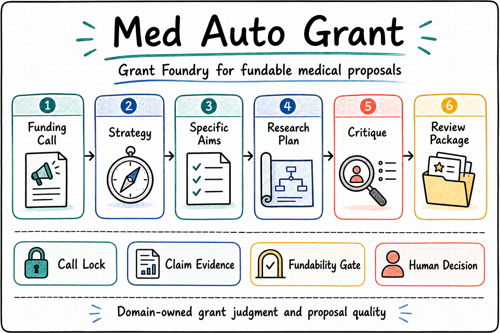

  

  <a href="./README.md"><strong>English</strong></a> | <a href="./README.zh-CN.md">中文</a>

# Med Auto Grant

**A Foundry Agent for medical grant authoring, published as an OPL-compatible package built on the OPL Framework**

> `Med Auto Grant` is an independent medical grant domain agent and OPL-compatible Foundry Agent package. It keeps specified-funder body authoring, critique, revision, and scientific review-package delivery on one line for investigator-side medical grant applications.

<table>
  <tr>
    <td width="33%" valign="top">
      <strong>Who It Serves</strong> 
      Doctors, PIs, faculty members, and medical research teams preparing investigator-side grant applications
    </td>
    <td width="33%" valign="top">
      <strong>What It Organizes</strong> 
      A specified funding call, prior work, pilot evidence, draft versions, review comments, and review-package files inside one workspace
    </td>
    <td width="33%" valign="top">
      <strong>How To Start</strong> 
      Tell it the target funding call, your current draft/materials, scientific claims to defend, and the review package you need
    </td>
  </tr>
</table>

  

## One-Sentence Quick Start

You can start with prompts like:

- "Use this NSFC call and this draft to rebuild title, abstract, aims, and methods so the scientific story is internally consistent."
- "Review this current draft for claim-evidence gaps and rewrite the weak sections without changing the target funding call."
- "Review this draft like a grant reviewer, tell me the biggest weaknesses, and show me how to revise them."

## What It Helps With

- Turning prior work, pilot data, and applicant materials into a stronger title, abstract, aims, and research plan under a specified funding call.
- Keeping revision rounds, reviewer-style critique, and version changes traceable inside one workspace.
- Comparing proposal quality across versions through structured scorecards, issue closure, and evidence-gap reports.
- Running longer controller-led authoring cycles that can continue, roll back, or stop with a blocker report.
- Delivering a scientifically complete review-ready package before portal-facing formal checks.
- Tracking formal/objective supplements as explicit TODO wakeups, instead of blocking body authoring by default.

## How It Works

- Applicants provide the target funding call, existing evidence, constraints, and final judgment.
- The AI operator helps with scientific structure, drafting, critique, and revision within that call.
- The workspace keeps comments, versions, and deliverable files together so the proposal line stays reviewable.
- New intake workspaces are directory scaffolds: `workspace.json` is the canonical document, while lightweight contracts/artifacts can be Git-tracked and local runtime outputs remain ignored.

## Current Boundary

- `Med Auto Grant` is an independent medical grant domain agent, not an internal module inside the `OPL` workspace.
- Public package role: `Foundry Agent / OPL-compatible package built on OPL Framework`.
- Its first public surface is the single Med Auto Grant app skill; `Codex`, `OPL`, and other general agents can reach the stable callable surfaces through that skill or directly through `CLI` / `MedAutoGrantDomainEntry`.
- The repo-root OPL standard pack is the generated-interface source for OPL. OPL compiles that pack into the generated CLI / MCP / Skill / product-entry / tool descriptors; the local CLI, `MedAutoGrantDomainEntry`, product-entry/projection commands, and schema-backed local scripts/contracts remain MAG-owned action targets and authority functions behind those descriptors.
- `product entry/product status/direct-entry/user-loop` stay as internal command contracts and direct-product projections under the app skill, not as the public first subject.
- The unified release shape is the app skill catalog plus MAG-owned stage control plane, hosted-contract-bundle handoff export, and local `submission-ready` delivery export.
- MAG task scope is locked to body authoring for a specified funding call.
- Scientific completion is delivered as a review-ready package; formal/objective supplements are tracked separately.
- Formal/objective supplements default to `TODO + explicit wakeup` and do not block body authoring unless they directly break scientific validity.
- `hosted-contract-bundle` and `runtime_control` stay as integration/reference surfaces for machine-readable handoff, not as the primary public entry.
- Human gate decisions stay inside the same funding-call task and are author decisions, not cross-funder reselection.
- External funding portal submission stays under human supervision.

  
<strong>Technical OPL / executor boundary</strong>

- `OPL` is the stage-led agent runtime framework that can host MAG as an external domain dependency.
- Within that framework, an Agent executor is the minimum execution unit. `Codex CLI` is the current first-class executor; Hermes-Agent and similar executors are explicit opt-in adapters that must produce auditable receipts and are not assumed to match Codex CLI behavior or quality.
- OPL can schedule stages, wakeups, handoffs, receipts, retries, and projections, while MAG keeps the grant stage pack, prompts, skills, fundability/authoring quality gates, authoring truth, and submission-ready export authority.
- MAG remains the owner for grant truth, fundability verdicts, authoring quality verdicts, route ownership, and submission/export authority.
- Domain memory and owner/lifecycle receipt apply are limited to consumed memory refs, writeback proposals, MAG accept/reject decisions, owner/no-regression receipt refs, lifecycle receipt refs, runtime receipt evidence, operator receipt projections, and repo-source layout audit. They do not write fundability verdicts, real grant artifacts, memory bodies, export verdicts, or receipt instances into repo source.
- Historical `OPL Runtime Manager`, Hermes-first, gateway, and local-host runtime wording is provenance or an implementation-provider detail. Temporal's required OPL production-substrate role is owned by OPL Framework and does not become MAG grant-domain runtime truth. MAG remains the grant-truth and authoring-contract owner.

## How To Read This Repository

1. Potential users should start here, then continue to the [Docs Guide](./docs/README.md), [Domain Positioning](./docs/public/domain-positioning.md), and [MVP Scope](./docs/public/mvp-scope.md).
2. Technical readers and planners should read [Project](./docs/project.md), [Status](./docs/status.md), [Architecture](./docs/architecture.md), [Invariants](./docs/invariants.md), [Decisions](./docs/decisions.md), and [Contracts Overview](./contracts/README.md).
3. Developers and maintainers should continue into `docs/active/`, `docs/specs/`, `docs/references/`, and [History Archive](./docs/history/README.md).

## Agent And Operator Quick Start

  
<strong>Start here if you are handing this repo to Codex or another agent</strong>

- Read the [Docs Guide](./docs/README.md) first. It summarizes the current technical picture, the formal-entry matrix, the stable capability surface, and where repo-tracked truth lives.
- Then read [Contracts Overview](./contracts/README.md) and [`contracts/runtime-program/current-program.json`](./contracts/runtime-program/current-program.json). That is the fastest path to the active product-entry shell, schema-backed surfaces, and current mainline pointer.
- Treat [Project](./docs/project.md), [Status](./docs/status.md), [Architecture](./docs/architecture.md), [Invariants](./docs/invariants.md), and [Decisions](./docs/decisions.md) as the public and technical truth set before changing routes or wording.
- The current formal-entry matrix is `CLI`, `MCP`, and `controller`. `CLI` / `MedAutoGrantDomainEntry` are MAG-owned action targets; `product entry/product status/direct-entry/user-loop`, plus local scripts/contracts only when schema-backed and surfaced through those runtime contracts, are internal command contracts and direct-product projections under the app skill. The repo-root OPL standard pack is what OPL uses for generated descriptors, so hosted or proof backends remain explicit opt-in integration lanes rather than the default public contract.
- MAG can be invoked directly through its Codex app skill or through OPL. Both routes must converge on the same MAG-owned route, quality, workspace, and export surfaces.
- When an external agent or OPL wants the repo-tracked skill surface directly, use the repo-local launcher `uv run --directory <med-autogrant-repo> medautogrant product skill-catalog --input <input_path> --format json`; it returns one Med Auto Grant app skill plus the underlying command contracts.
- For pre-authoring intake, use `uv run --directory <med-autogrant-repo> medautogrant workspace initialize-intake --input <selection_input> --workspace-root <workspace_dir> --format json`; the directory gets a workspace-local Git boundary and `workspace.json` becomes the canonical MAG document.
- The single skill descriptor now carries a `runtime_continuity` envelope for direct family-caller consumption, reusing existing `session_continuity` / `progress_projection` / `artifact_inventory` / `runtime_control.semantic_closure` truth for authoring continuity, funding-call lock, quality closure, and the stricter submission-ready gate.
- The product-entry manifest also carries `controlled_domain_memory_apply_proof`, `owner_receipt_contract`, and `lifecycle_guarded_apply_proof`, which let OPL or a direct caller audit consumed grant-strategy memory refs, writeback proposal, accept/reject decision, owner/no-regression receipt refs, lifecycle receipt refs, runtime receipt evidence, operator receipt projection, and repo-source layout without receiving memory body or grant artifacts.
- Current machine-readable governance surfaces include `workspace quality-scorecard`, `workspace quality-diff`, and `pass autonomy-controller`.

## Maintainer Verification

- Use `./scripts/verify.sh` for the default local gate. It runs the line-budget check, the minimal smoke lane, and the fast non-regression core lane.
- Makefile Python and pytest lanes run through `scripts/run-python-clean.sh` / `scripts/run-pytest-clean.sh`, which route bytecode and pytest cache outside the checkout.
- Use `./scripts/verify.sh smoke` or `make test-cli-smoke` for quick CLI/product/runtime entry health checks.
- Use `./scripts/verify.sh regression` for heavier matrix, product-entry, runtime/session, hosted/export, and regression coverage. Product-entry cases live under `tests/product_entry_cases/` as directly collected regression tests; the old `tests/test_product_entry.py` aggregation surface has been removed.
- Use `./scripts/verify.sh meta`, `./scripts/verify.sh structure`, and `./scripts/verify.sh full` for repo governance, architecture checks, and clean-clone/full-suite baselines.

## Further Reading

- [Docs Guide](./docs/README.md)
- [Domain Positioning](./docs/public/domain-positioning.md)
- [MVP Scope](./docs/public/mvp-scope.md)
- [Project](./docs/project.md)
- [Status](./docs/status.md)
- [Architecture](./docs/architecture.md)
- [Invariants](./docs/invariants.md)
- [Decisions](./docs/decisions.md)
- [Contracts Overview](./contracts/README.md)
