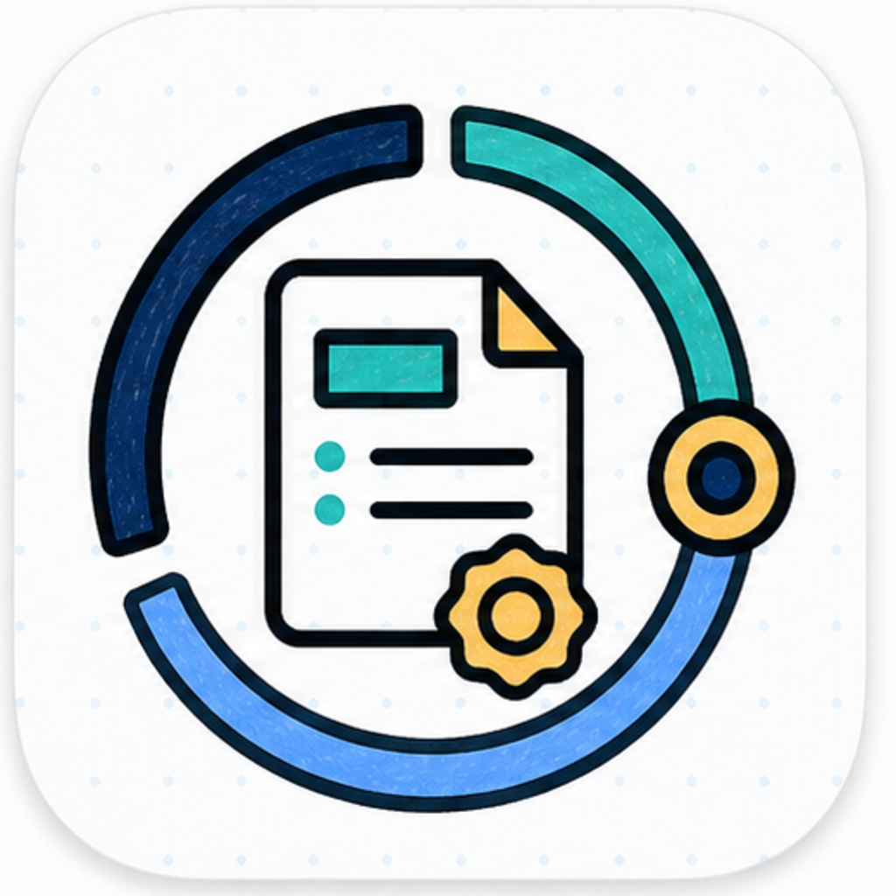
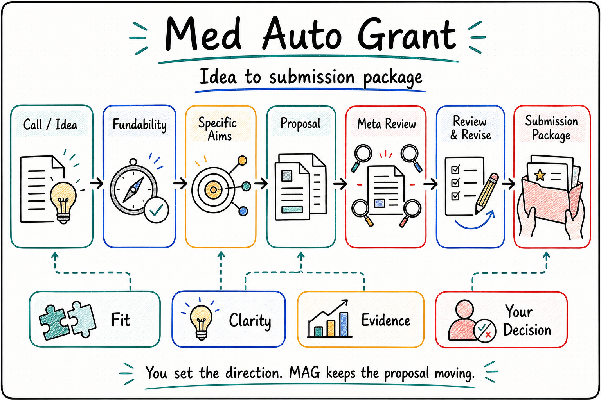

<p align="center">
  
</p>

[English](./README.md) | [中文](./README.zh-CN.md)

# Med Auto Grant

Med Auto Grant helps applicants plan, write, review, revise, and assemble medical grant proposals around one funding call. It keeps source evidence, scientific questions, applicant fit, draft versions, reviewer findings, and local deliverables in the same grant workspace.

<p align="center">
  
</p>

## Start A Grant Task

Provide the target funding call, applicant/team materials, prior papers or pilot evidence, current draft, and the result you need. For example:

> Use this NSFC call and draft to revise the aims and methods, review the scientific argument independently, and produce a reviewable proposal package without changing the target call.

The installed `med-autogrant` Skill selects the OPL-generated action. The default action continues the grant workflow; bounded authoring requires accepted upstream context, and local package export requires an explicit request, output directory, and the export human gate. See [entry boundaries](./docs/product/README.md).

Scientific review readiness, local submission-package readiness, and external portal submission are separate results. Formal supplements remain explicit follow-up work unless they affect scientific validity. Portal upload, signatures, certification, and final submission remain human-authorized actions.

## Install The Codex Carrier

This repository supplies the Codex plugin carrier `med-autogrant`; the OPL Agent/Package identity is `mag`. From a clone:

```bash
codex plugin marketplace add .
codex plugin marketplace list --json
codex plugin list --marketplace med-autogrant --available --json
codex plugin add med-autogrant@med-autogrant --json
codex plugin list --marketplace med-autogrant --json
```

Start a new Codex App task or CLI session to load the installed Skill. To remove this carrier and its marketplace:

```bash
codex plugin remove med-autogrant@med-autogrant --json
codex plugin marketplace remove med-autogrant --json
```

These commands manage only the Codex carrier. They do not prove Framework availability, required ScholarSkills callability, complete runtime installation, grant quality, or production readiness. Read the full Package state through a current OPL Base:

```bash
opl packages status --package-id mag --json
```

Follow the returned owner action when runtime or dependency evidence is missing. An unavailable `packages` command indicates that the current OPL Base must be checked; a successful plugin install is not full Package readiness.

## Project And Development

MAG owns grant judgment, artifacts/packages, strategy-memory decisions, and owner receipts. OPL owns generic runtime, executor transport, generated actions/status, and recovery; the App consumes those surfaces. Implementation and open evidence are described in [status](./docs/status.md), not inferred from the repository version.

- [Project scope](./docs/project.md)
- [Documentation and verification](./docs/README.md)
- [Architecture](./docs/architecture.md)
- [Machine contracts](./contracts/README.md)

For local checks run `./scripts/verify.sh`; focused and full lanes, clean-runner requirements, and documentation lifecycle are explained in the [documentation guide](./docs/README.md#验证).
