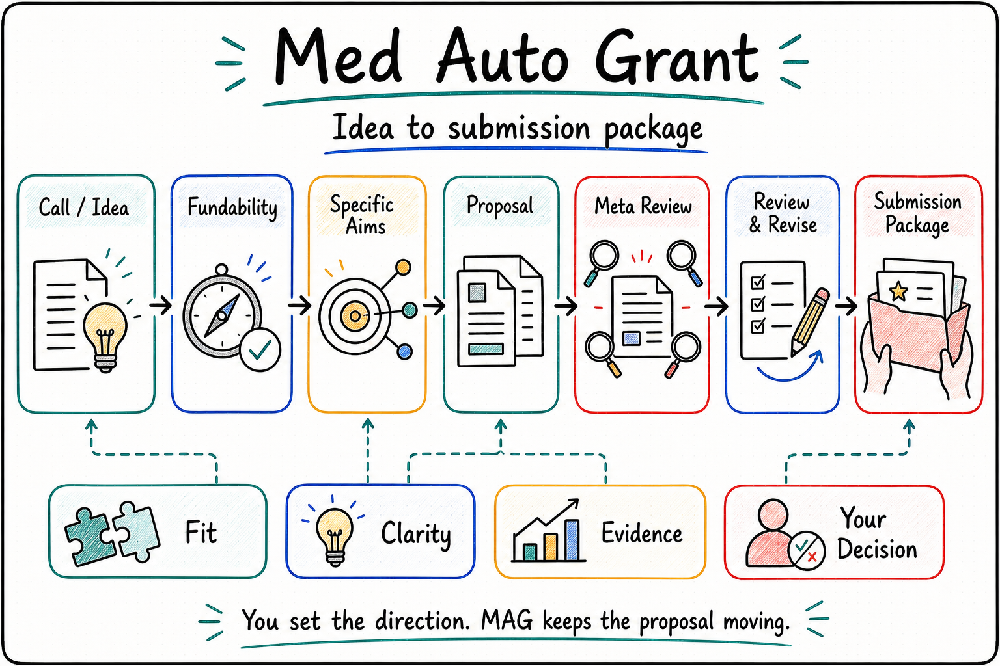

<p align="center">
  
</p>

[English](./README.md) | [中文](./README.zh-CN.md)

# Med Auto Grant

Med Auto Grant 围绕同一 funding call，帮助申请人规划、撰写、独立评审、修订和组装医学基金申请。来源证据、科学问题、申请人适配、草稿版本、评审发现与本地交付物保存在同一申请工作区。

<p align="center">
  
</p>

## 开始申请任务

提供目标基金指南、申请人和团队材料、既有论文或预实验、当前草稿，以及希望得到的结果。例如：

> 按这个国自然指南和草稿修订研究目标与方法，独立评审科学论证，并在不改变目标基金的前提下形成可评审的申请书包。

安装后的 `med-autogrant` Skill 选择 OPL-generated action。默认 action 继续申请流程；有界正文写作须有 accepted upstream context，本地 package export 须有明确请求、输出目录和 export human gate。详细条件见[产品入口](./docs/product/README.md)。

科学上可评审、本地提交包已就绪和外部门户已提交是不同结果。形式补件作为明确待办，除非直接影响科学成立性。门户上传、签字、认证和最终提交仍须人工授权。

## 安装

通过 OPL 的标准软件包入口安装：

```bash
opl packages install mag --json
opl packages status --package-id mag --json
```

正式发布渠道为 `ghcr.io/gaofeng21cn/one-person-lab-packages/mag`，不可变版本用于精确引用，`latest-stable` 指向当前版本。OPL 与原生插件管理器负责安装和更新；不通过独立 GitHub Release 页面或附件分发。

运行需要 `mas-scholar-skills`；安装时由软件包依赖关系处理。

安装后新建任务以加载专业技能。软件包安装、运行可用性和领域验收分别记录；具体边界见[当前状态](./docs/status.md)。

## 项目与开发

MAG 持有基金判断、artifact/package、策略记忆决定和 owner receipt；OPL 持有通用 runtime、executor transport、generated action/status 和恢复，App 消费这些表面。实现与未闭合证据见[状态](./docs/status.md)，不能从仓库版本推导运行结论。

- [项目范围](./docs/project.md)
- [文档与验证](./docs/README.md)
- [架构](./docs/architecture.md)
- [机器合同](./contracts/README.md)

本地检查使用 `./scripts/verify.sh`；定向/full lane、clean runner 前提与文档生命周期见[文档指南](./docs/README.md#验证)。
